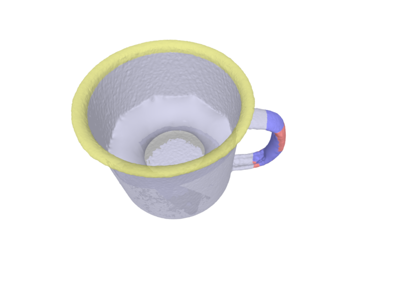
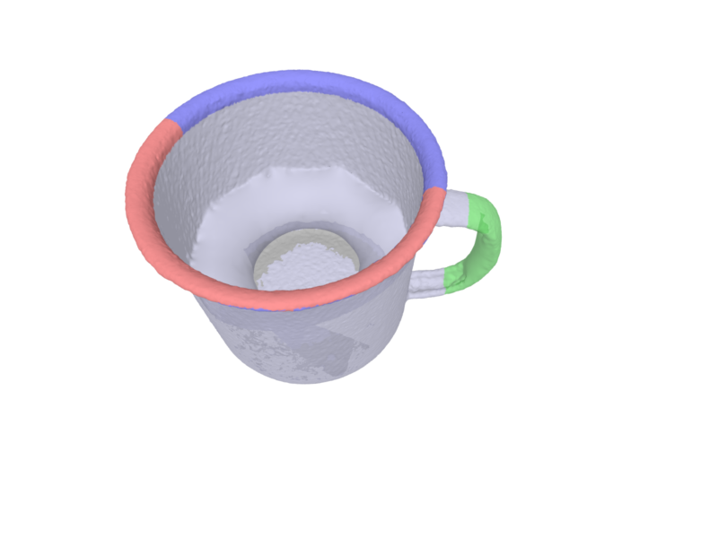
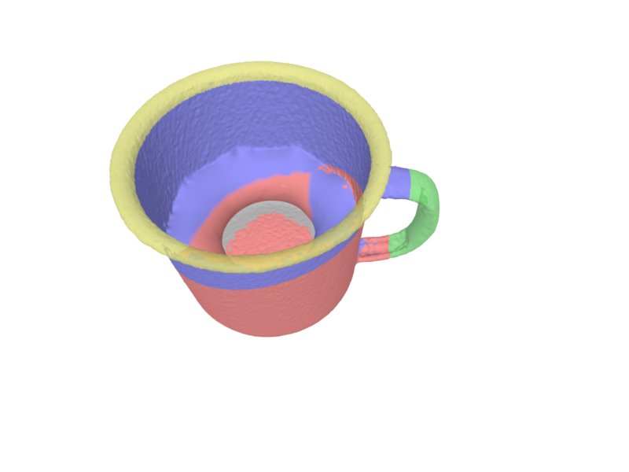

# Affordance Labeller

휴머노이드 로봇 양손 파지(bimanual grasping)를 위한 어포던스 라벨링 도구.

PyVista+Trame 기반 웹 UI에서 3D 메시를 보면서 part 분류, affordance 라벨링, contact mask 지정, 6D candidate pose 추가를 수행합니다. 드래그로 직접 칠하고, Ctrl+드래그로 orbit 회전하며, 우클릭으로 지우기가 가능합니다.

> **처음 사용하시나요?** [사용자 가이드 (USER_GUIDE.md)](docs/USER_GUIDE.md)를 참고하세요.





## 빠른 시작

```bash
# 1. 환경 설치
cd src/
bash scripts/setup_env.sh

# 2. conda 환경 활성화
conda activate affordance_labeller

# 3. YCB 에셋 다운로드 (mug, mustard bottle, power drill, banana)
python scripts/download_ycb.py

# 4. 실행 (PyVista+Trame)
python app/main.py --mesh assets/ycb/025_mug/google_512k/nontextured.ply --server

# 5. 브라우저에서 접속
# http://localhost:8080
```

다른 객체:
```bash
# YCB power drill
python app/main.py --mesh assets/ycb/035_power_drill/google_512k/nontextured.ply --object-id ycb_035_power_drill --server

# 임의 mesh 파일
python app/main.py --mesh /path/to/your/object.ply --object-id my_object --server
```

기존 라벨 로드:
```bash
python app/main.py --mesh assets/ycb/025_mug/google_512k/nontextured.ply --label labels/sample_handle_grasp.json --server
```

## 조작법

| 조작 | 동작 |
|------|------|
| **좌클릭 / 드래그** | Part painting (Start Painting 모드) |
| **우클릭 / 드래그** | 선택된 part에서 vertex 지우기 |
| **Ctrl + 드래그** | Orbit 회전 |
| **스크롤** | 줌 인/아웃 |

## 라벨링 워크플로우

```
1. Object Info → 2. Parts → 3. Affordances → 4. Contact Masks → 5. Poses → Save
```

### 1. Part 정의

- **Auto Semantic Segment (mug)**: mug 전용, body/handle/rim/base 의미적 분류
- **Auto Geometric Segment**: K-means + 법선 기반 범용 분할 (클러스터 수 조절 가능)
- **수동 Painting**: Part Name 입력 → Add → Paint → 클릭/드래그로 칠하기
- **Rename**: 자동 분할 후 region_0 → grip 등으로 이름 변경 (색상 보존)
- **3D 범례**: 좌측 상단에 part/affordance/mask 색상 범례 실시간 표시
- **Provenance**: 자동 분할(🤖) vs 수동(✋) 구분 기록

### 2. Affordance 할당

Target Part 선택 → Affordance Class + Semantic Tag 지정 → Assign

| Class | 의미 |
|-------|------|
| graspable | 파지 가능 |
| pour_support | 따르기 지지 |
| handover_region | 전달 영역 |
| placeable | 놓기 가능 |
| non_affordance | 비기능 |

### 3. Contact Mask

**수동 할당**: Patch A/B에 각각 part를 지정 + finger role 선택

**Auto Split**: PCA 주성분 방향으로 part vertex를 자동 양분 → Patch A/B 제안

### 4. Pose 배치

**Place Pose** → 객체 표면 클릭 → RGB 좌표축 생성 (빨강=X, 초록=Y, 파랑=Z)

**회전 편집**: Select Pose → Roll/Pitch/Yaw 슬라이더로 실시간 회전

### 5. Save / Load / Export

- **Save**: JSON 메타데이터 + .npy vertex 바이너리 + manifest.json (checksum)
- **Load**: manifest 기반 무결성 검증 + 색상 오버레이 자동 복원
- **Export Bundle**: JSON + .npy + manifest를 .zip으로 묶어 공유/백업
- **Review Workflow**: draft → in_review → reviewed → approved 단계별 전환 (validation 차단 포함)

## 기술 스택

| 구성 요소 | 기술 |
|-----------|------|
| 프론트엔드 | [PyVista](https://pyvista.org/) + [Trame](https://kitware.github.io/trame/) (웹 기반 3D) |
| 3D 처리 | trimesh + VTK |
| 상호작용 | Custom VTK InteractorStyle (Ctrl+orbit / click painting / right-click erase) |
| 저장 | JSON + .npy 바이너리 분리 + manifest (jsonschema 검증) |
| 분할 | K-means + 법선 클러스터링 (범용) / 기하학 heuristic (mug) |
| 대상 데이터 | YCB Object Dataset (4종) + 임의 mesh |

## 프로젝트 구조

```
Affordance_Labeller/
├── README.md
├── CLAUDE.md
├── docs/
│   ├── Phase1/             # Phase 1 계획 + 실행 기록 (완료)
│   ├── Phase2/             # Phase 2 계획 + 갭 분석 (완료)
│   ├── Phase3/             # Phase 3 완료사항
│   └── USER_GUIDE.md       # 사용자 가이드
└── src/
    ├── app/
    │   ├── main.py              # Trame 앱 본체 (797줄)
    │   ├── interactor.py        # VTK InteractorStyle (125줄)
    │   ├── viewer.py            # mesh 로드 + auto segment (333줄)
    │   ├── viewer_trame.py      # PyVista mesh 관리 (70줄)
    │   └── io_handler.py        # JSON 저장/로드/검증/manifest (613줄)
    ├── assets/ycb/              # YCB 에셋 (git 제외)
    ├── labels/                  # 라벨 JSON + .npy + 프리뷰 이미지
    ├── schemas/
    │   └── label_v0.1.json      # JSON 스키마
    └── scripts/
        ├── setup_env.sh         # 환경 설치
        └── download_ycb.py      # YCB 다운로드 (4종)
```

## 저장 구조

```
labels/
├── ycb_025_mug.json              # 메타데이터 (< 10KB)
└── ycb_025_mug_vertices/
    ├── part_body.npy              # vertex indices (바이너리)
    ├── aff_handle_graspable.npy
    ├── mask_handle_pinch_patch_a.npy
    └── manifest.json              # 파일 목록 + checksum
```

## JSON 스키마 (v0.1)

```
object_id → parts → affordances → contact_region_masks → candidate_poses
                     ↑ part_ref     ↑ part_ref            ↑ linked_affordance_id
                                                          ↑ linked_mask_id
```

## 지원 객체

| 객체 | 분류 방법 |
|------|----------|
| YCB Mug (025) | Auto Semantic + 수동 |
| YCB Mustard Bottle (006) | Auto Geometric + 수동 |
| YCB Power Drill (035) | Auto Geometric + 수동 |
| YCB Banana (011) | Auto Geometric + 수동 |
| 임의 .ply/.obj/.stl | Auto Geometric + 수동 |

## 색상 범례

3D 뷰포트 좌측 상단에 실시간 범례가 표시됩니다.

| 색상 | 의미 |
|------|------|
| 커스텀 팔레트 (8색 순환) | Part 영역 |
| 초록 | graspable affordance |
| 파랑 | pour_support affordance |
| 주황 | handover_region affordance |
| 빨강 | Contact Patch A (thumb 쪽) |
| 파랑 | Contact Patch B (fingers 쪽) |
| RGB 화살표 | Candidate Pose 좌표축 (X=빨강, Y=초록, Z=파랑) |

## 개발 현황

| Phase | 상태 | 핵심 |
|-------|------|------|
| Phase 1 | 완료 | Viser MVP, Gate 1~4 통과 |
| Phase 2 | 완료 | AppState + 모듈 분리 + .npy + click-to-paint + pose gizmo |
| Phase 3 Sprint A | 완료 | PyVista+Trame 전환 + bundle manifest |
| Phase 3 Sprint B | 완료 | K-means 자동 분할 + PCA patch 제안 + rename + legend |
| Phase 3 Sprint C | 완료 | Review workflow + bundle .zip export + export mapping memo |
| Phase 3 Sprint D | 미진행 | confidence heuristic + 렌더링 최적화 |
| Phase 4 | 구상 | VR + Isaac Sim 자동 라벨링 |

## 개발자

고광은 박사 (로보틱스/컴퓨터비전 연구자)
